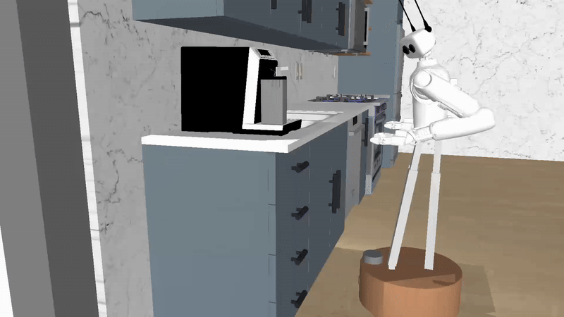

# Reachy 2 MuJoCo Assets

This repository contains scenes and configuration files for the robot **Reachy 2** in [MuJoCo](https://mujoco.org/). These assets are used by Reachy's 2 software stack.

<div align="center">



</div>

## Stack installation
Install the Reachy 2 software stack easily by using the [one liner](https://docs.pollen-robotics.com/developing-with-reachy-2/simulation/simulation-installation/#running-with-mujoco) provided in the documentation.

## Available Scenes

- `base_scene.xml`: the default empty scene
- `fruits_scene.xml`: a scene for sorting fruits on a table
- `kitchen_scene.xml`: full kitchen for complex manipulation tasks
- `table_scene.xml`: a simple scene with just one cube to manipulate on a table

### Visualization

A viewer script is provided to visualize the scenes in Mujoco. You can run it with the following command:

```bash
python viewer.py <scene_file.xml>
```

**Note:** Mujoco must be installed via pip:

```bash
pip install mujoco
```